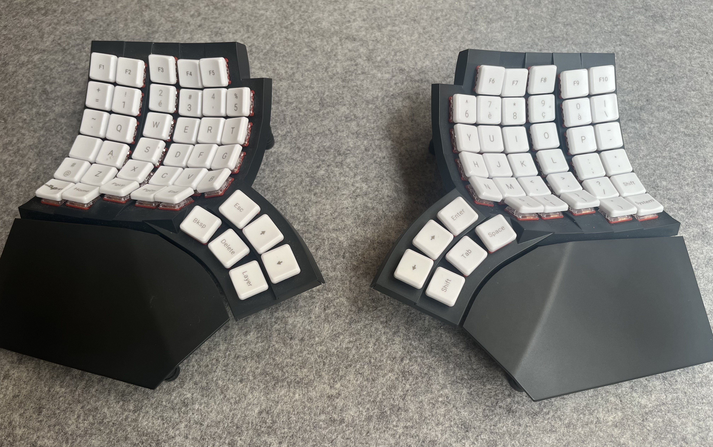

## Glove 80 config

This is my config for Glove80. It's very largely inspired by [sunaku work](https://github.com/sunaku/glove80-keymaps) version `36`.

I use QWERTY layout and some custom stuff to use vim motion and other stuff (Hyper key, specific arrow keys...)

[MoErgo layout Editor](https://my.glove80.com/#/layout/user/a5ff6829-8496-496f-9dc7-629587da5bce)

